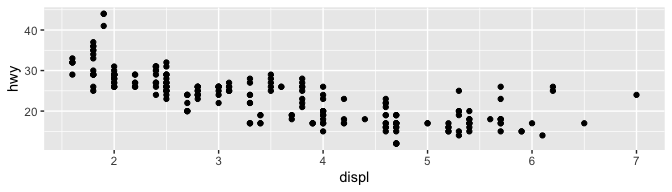
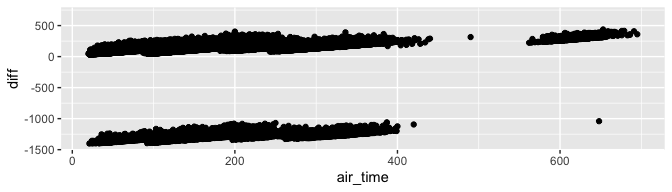
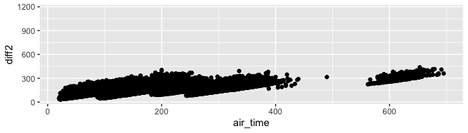
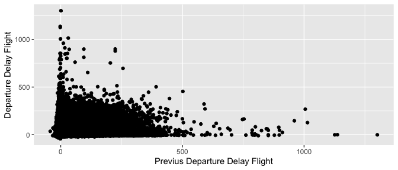
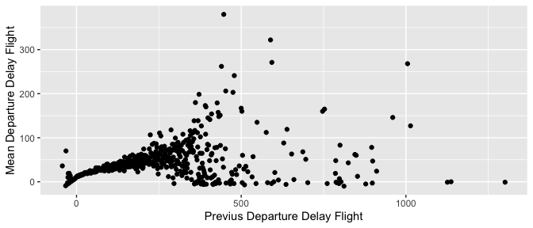

## 1. Front matter

Due Friday April 8, 5:00PM Central.

Initiate your repo: <https://classroom.github.com/a/-PgTc6cw>

Submit by pushing your code to your repo on Github Classroom.

This submission is my work alone and complies with the 30535 integrity
policy.

Add your initials to indicate your agreement: **KEZG**

Add names of anyone you discussed this problem set with: **NO**

Late coins used this pset: 0. Late coins left after submission: 5.

We use (\*) to indicate a problem that we think might be time consuming.

Notes on submission (10 pts)

-   Name your submission files skills\_ps\_2.Rmd and skills\_ps\_2.pdf.
-   Knit your RmD to PDF and submit via Gradescope.
-   Assign the correct page number to the question number on gradescope
    to help the grading process.
-   The PDF should not be more than 25 pages, use head() and re-size
    figures when appropriate.

## 2. Git concepts

**1. Git is software for distributed version control. List 4 benefits of
distributed version control.**

-   Backup copies in the cloud, which collects the editions of the
    document.
-   Being able to work offline. Git does not require an Internet
    connection. This helps the team to work at any time and place
    regardless of their connection. The run history is left on the hard
    drive.
-   Quick merge and flexible branching. Since there is no remote server,
    the code is merged faster. Also, the team can access different
    forking strategies, which is not possible with a centralized system.
-   Fast feedback and fewer merge conflicts.Having access to the history
    of changes helps to go back to previous versions and review errors.
    Also, since the repository is on a local workstation, you can
    quickly request code reviews. Finally, merge conflicts are less
    likely.

Source:
<https://about.gitlab.com/topics/version-control/benefits-distributed-version-control-system/>

**2. For the next questions, we will reference “Learn git concepts, not
commands”. Read sections from “Overview” through “Branching”. It is
written with git commandline in mind, but github desktop has all these
features as well. Focus on the concepts (ie understand the pictures).
Save some changes to your homework and make sure it’s being tracked by
git with github deskop.**

1.  What is the remote repository for this homework? Be as specific as
    possible.

-   Remote Github repository
    <https://github.com/datasci-harris/skills-problem-set-2-khristel26.git>

-   In desktop:
    Users/khristelzavaleta/Documents/GitHub/skills-problem-set-2-khristel26

**ii. How do you add a file to staging in github desktop? (This is
subtle, because it happens automatically).**

1.  On GitHub.com, we can navigate to the main page of the repository.
    Then, above the list of files, we can click “Add file” and then
    click “Upload files”.

2.  We can add a file to the folder that contains our repository on our
    computer (when the repository is cloned on our computer), and then
    commit the file and push it to GitHub.

**iii. How do you commit an issue to the local repository? (This is not
subtle).**

We have to go to the Github application on our computer, and then click
on the “commit to main” option, previously we have the option to give
the commit a summary and a description.

**iv. How does github desktop decide what part of your code to show in
the main part of the window?**

Github desktop shows in the main part of the screen, the changes made to
the file. The lines of code appear in red or green to indicate deletes
or additions of code.

**v. What branch are you on right now? Why?**

I am now on the main branch, this branch is assigned by default at the
start.

**vi. If you were to click on “current branch”, type a name and click
the “New Branch” button, you would create a new branch.**

**a. What would happen to the files in your working directory?**

Now in “current branch” there are two branches, and therefore a file can
be edited separately in this second branch without this implying a
change in the other branch (a change in “New Branch” would not be
reflected in “Main”).

**b. What would happen in the remote repo?**

Two branches and two versions of the code appear in the remote GitHub
repository.

**c. Why would you want to work on a different branch?**

When it is important to preserve the original code into a chain of
changes, for reference purposes. It may be that the main branch is a
model version of what you are looking for, and will serve to guide all
future codes and changes

**If you created a new branch in the previous step, nice!
Experimentation develops your skills and understanding.Now, make sure
you are on master as you continue your homework.**

## 3. Practicing with dplyr verbs

### 3.1 Debugging mindset (5 pts)

**1. Why doesn’t this code work?**

my\_variable &lt;- 10 my\_variab1e

This formula is not working because the name of the variable created is
“my\_variable” and not “my\_variab1e” (a 1 instead of an “l”), it is
necessary to call the variable by the same name assigned to have the
result ‘10’.

**2. Tweak each of the following R commands so that they run
correctly:**

1.  library(tidilyverse)

2.  ggplot(dota = mpg) + geom\_point(mapping = aes(x = displ, y = hwy))

3.  fliter(mpg, cyl = 8)

4.  filter(diamond, carat &gt; 3)

Modifying:

-   1.  The package name is ‘tidyverse’ and not ‘tidilyverse’

<!-- -->

    library(tidyverse)

-   1.  There is a typo, saying ‘dota’ instead of ‘data’

<!-- -->

    ggplot(data = mpg) + geom_point(mapping = aes(x = displ, y = hwy))

-   1.  There are two error here, (1) the function is filter() and not
        fliter(). Also, we need double equal sign to establish equality

<!-- -->

    filter(mpg, cyl == 8)

    ## # A tibble: 70 × 11
    ##    manufacturer model      displ  year   cyl trans drv     cty   hwy fl    class
    ##    <chr>        <chr>      <dbl> <int> <int> <chr> <chr> <int> <int> <chr> <chr>
    ##  1 audi         a6 quattro   4.2  2008     8 auto… 4        16    23 p     mids…
    ##  2 chevrolet    c1500 sub…   5.3  2008     8 auto… r        14    20 r     suv  
    ##  3 chevrolet    c1500 sub…   5.3  2008     8 auto… r        11    15 e     suv  
    ##  4 chevrolet    c1500 sub…   5.3  2008     8 auto… r        14    20 r     suv  
    ##  5 chevrolet    c1500 sub…   5.7  1999     8 auto… r        13    17 r     suv  
    ##  6 chevrolet    c1500 sub…   6    2008     8 auto… r        12    17 r     suv  
    ##  7 chevrolet    corvette     5.7  1999     8 manu… r        16    26 p     2sea…
    ##  8 chevrolet    corvette     5.7  1999     8 auto… r        15    23 p     2sea…
    ##  9 chevrolet    corvette     6.2  2008     8 manu… r        16    26 p     2sea…
    ## 10 chevrolet    corvette     6.2  2008     8 auto… r        15    25 p     2sea…
    ## # … with 60 more rows

-   1.  The correct data frame name is ‘diamonds’ and not ‘diamond’

<!-- -->

    filter(diamonds, carat > 3)

    ## # A tibble: 32 × 10
    ##    carat cut     color clarity depth table price     x     y     z
    ##    <dbl> <ord>   <ord> <ord>   <dbl> <dbl> <int> <dbl> <dbl> <dbl>
    ##  1  3.01 Premium I     I1       62.7    58  8040  9.1   8.97  5.67
    ##  2  3.11 Fair    J     I1       65.9    57  9823  9.15  9.02  5.98
    ##  3  3.01 Premium F     I1       62.2    56  9925  9.24  9.13  5.73
    ##  4  3.05 Premium E     I1       60.9    58 10453  9.26  9.25  5.66
    ##  5  3.02 Fair    I     I1       65.2    56 10577  9.11  9.02  5.91
    ##  6  3.01 Fair    H     I1       56.1    62 10761  9.54  9.38  5.31
    ##  7  3.65 Fair    H     I1       67.1    53 11668  9.53  9.48  6.38
    ##  8  3.24 Premium H     I1       62.1    58 12300  9.44  9.4   5.85
    ##  9  3.22 Ideal   I     I1       62.6    55 12545  9.49  9.42  5.92
    ## 10  3.5  Ideal   H     I1       62.8    57 12587  9.65  9.59  6.03
    ## # … with 22 more rows

**3. Press Alt + Shift + K. What happens? How can you get to the same
place using the menus?**

The RStudio keyboard shortcuts appears on screen. We can get the same
results going to menu at the top: Tools &gt; Keyboard Shortcuts Help.

### 3.2 Transformations: Filter rows with filter() (10 pts)

**1. Using the flights data from the nycflights13 package. Find all
flights that:**

    library(nycflights13)
    view(flights)
    ?flights

**i. Had an arrival delay of three or more hours**

    filter(flights, arr_delay / 60 >= 3)

    ## # A tibble: 3,897 × 19
    ##     year month   day dep_time sched_dep_time dep_delay arr_time sched_arr_time
    ##    <int> <int> <int>    <int>          <int>     <dbl>    <int>          <int>
    ##  1  2013     1     1      848           1835       853     1001           1950
    ##  2  2013     1     1     1815           1325       290     2120           1542
    ##  3  2013     1     1     1842           1422       260     1958           1535
    ##  4  2013     1     1     2006           1630       216     2230           1848
    ##  5  2013     1     1     2115           1700       255     2330           1920
    ##  6  2013     1     1     2205           1720       285       46           2040
    ##  7  2013     1     1     2312           2000       192       21           2110
    ##  8  2013     1     1     2343           1724       379      314           1938
    ##  9  2013     1     2     1244            900       224     1431           1104
    ## 10  2013     1     2     1332            904       268     1616           1128
    ## # … with 3,887 more rows, and 11 more variables: arr_delay <dbl>,
    ## #   carrier <chr>, flight <int>, tailnum <chr>, origin <chr>, dest <chr>,
    ## #   air_time <dbl>, distance <dbl>, hour <dbl>, minute <dbl>, time_hour <dttm>

**ii. Flew to Houston (IAH or HOU)**

    filter(flights,dest == "IAH" | dest == "HOU")

    ## # A tibble: 9,313 × 19
    ##     year month   day dep_time sched_dep_time dep_delay arr_time sched_arr_time
    ##    <int> <int> <int>    <int>          <int>     <dbl>    <int>          <int>
    ##  1  2013     1     1      517            515         2      830            819
    ##  2  2013     1     1      533            529         4      850            830
    ##  3  2013     1     1      623            627        -4      933            932
    ##  4  2013     1     1      728            732        -4     1041           1038
    ##  5  2013     1     1      739            739         0     1104           1038
    ##  6  2013     1     1      908            908         0     1228           1219
    ##  7  2013     1     1     1028           1026         2     1350           1339
    ##  8  2013     1     1     1044           1045        -1     1352           1351
    ##  9  2013     1     1     1114            900       134     1447           1222
    ## 10  2013     1     1     1205           1200         5     1503           1505
    ## # … with 9,303 more rows, and 11 more variables: arr_delay <dbl>,
    ## #   carrier <chr>, flight <int>, tailnum <chr>, origin <chr>, dest <chr>,
    ## #   air_time <dbl>, distance <dbl>, hour <dbl>, minute <dbl>, time_hour <dttm>

**iii. Were operated by United, American, or Southwest**

-   Looking up airline names from their carrier codes

<!-- -->

    view(airlines)

    filter(flights,carrier == "UA" | carrier == "AA" | carrier == "WN")

    ## # A tibble: 103,669 × 19
    ##     year month   day dep_time sched_dep_time dep_delay arr_time sched_arr_time
    ##    <int> <int> <int>    <int>          <int>     <dbl>    <int>          <int>
    ##  1  2013     1     1      517            515         2      830            819
    ##  2  2013     1     1      533            529         4      850            830
    ##  3  2013     1     1      542            540         2      923            850
    ##  4  2013     1     1      554            558        -4      740            728
    ##  5  2013     1     1      558            600        -2      753            745
    ##  6  2013     1     1      558            600        -2      924            917
    ##  7  2013     1     1      558            600        -2      923            937
    ##  8  2013     1     1      559            600        -1      941            910
    ##  9  2013     1     1      559            600        -1      854            902
    ## 10  2013     1     1      606            610        -4      858            910
    ## # … with 103,659 more rows, and 11 more variables: arr_delay <dbl>,
    ## #   carrier <chr>, flight <int>, tailnum <chr>, origin <chr>, dest <chr>,
    ## #   air_time <dbl>, distance <dbl>, hour <dbl>, minute <dbl>, time_hour <dttm>

**iv. Departed in spring (March, April, May and June)**

    filter(flights,month == 3 | month == 4 | month == 5 | month == 6)

    ## # A tibble: 114,203 × 19
    ##     year month   day dep_time sched_dep_time dep_delay arr_time sched_arr_time
    ##    <int> <int> <int>    <int>          <int>     <dbl>    <int>          <int>
    ##  1  2013     3     1        4           2159       125      318             56
    ##  2  2013     3     1       50           2358        52      526            438
    ##  3  2013     3     1      117           2245       152      223           2354
    ##  4  2013     3     1      454            500        -6      633            648
    ##  5  2013     3     1      505            515       -10      746            810
    ##  6  2013     3     1      521            530        -9      813            827
    ##  7  2013     3     1      537            540        -3      856            850
    ##  8  2013     3     1      541            545        -4     1014           1023
    ##  9  2013     3     1      549            600       -11      639            703
    ## 10  2013     3     1      550            600       -10      747            801
    ## # … with 114,193 more rows, and 11 more variables: arr_delay <dbl>,
    ## #   carrier <chr>, flight <int>, tailnum <chr>, origin <chr>, dest <chr>,
    ## #   air_time <dbl>, distance <dbl>, hour <dbl>, minute <dbl>, time_hour <dttm>

**v. Arrived more than two hours late, but didn’t leave late**

    filter(flights, arr_delay / 60 > 2 & dep_delay <= 0)

    ## # A tibble: 29 × 19
    ##     year month   day dep_time sched_dep_time dep_delay arr_time sched_arr_time
    ##    <int> <int> <int>    <int>          <int>     <dbl>    <int>          <int>
    ##  1  2013     1    27     1419           1420        -1     1754           1550
    ##  2  2013    10     7     1350           1350         0     1736           1526
    ##  3  2013    10     7     1357           1359        -2     1858           1654
    ##  4  2013    10    16      657            700        -3     1258           1056
    ##  5  2013    11     1      658            700        -2     1329           1015
    ##  6  2013     3    18     1844           1847        -3       39           2219
    ##  7  2013     4    17     1635           1640        -5     2049           1845
    ##  8  2013     4    18      558            600        -2     1149            850
    ##  9  2013     4    18      655            700        -5     1213            950
    ## 10  2013     5    22     1827           1830        -3     2217           2010
    ## # … with 19 more rows, and 11 more variables: arr_delay <dbl>, carrier <chr>,
    ## #   flight <int>, tailnum <chr>, origin <chr>, dest <chr>, air_time <dbl>,
    ## #   distance <dbl>, hour <dbl>, minute <dbl>, time_hour <dttm>

**vi. Were delayed by at least an hour, but made up over 30 minutes in
flight**

    filter(flights,dep_delay/60>=1 & dep_delay - 30 > arr_delay)

    ## # A tibble: 1,844 × 19
    ##     year month   day dep_time sched_dep_time dep_delay arr_time sched_arr_time
    ##    <int> <int> <int>    <int>          <int>     <dbl>    <int>          <int>
    ##  1  2013     1     1     2205           1720       285       46           2040
    ##  2  2013     1     1     2326           2130       116      131             18
    ##  3  2013     1     3     1503           1221       162     1803           1555
    ##  4  2013     1     3     1839           1700        99     2056           1950
    ##  5  2013     1     3     1850           1745        65     2148           2120
    ##  6  2013     1     3     1941           1759       102     2246           2139
    ##  7  2013     1     3     1950           1845        65     2228           2227
    ##  8  2013     1     3     2015           1915        60     2135           2111
    ##  9  2013     1     3     2257           2000       177       45           2224
    ## 10  2013     1     4     1917           1700       137     2135           1950
    ## # … with 1,834 more rows, and 11 more variables: arr_delay <dbl>,
    ## #   carrier <chr>, flight <int>, tailnum <chr>, origin <chr>, dest <chr>,
    ## #   air_time <dbl>, distance <dbl>, hour <dbl>, minute <dbl>, time_hour <dttm>

**vii. Departed between midnight and 5am (inclusive)**

    filter(flights, dep_time > 0 & dep_time <= 500)

    ## # A tibble: 1,487 × 19
    ##     year month   day dep_time sched_dep_time dep_delay arr_time sched_arr_time
    ##    <int> <int> <int>    <int>          <int>     <dbl>    <int>          <int>
    ##  1  2013     1     2       42           2359        43      518            442
    ##  2  2013     1     2      126           2250       156      233           2359
    ##  3  2013     1     2      458            500        -2      703            650
    ##  4  2013     1     3       32           2359        33      504            442
    ##  5  2013     1     3       50           2145       185      203           2311
    ##  6  2013     1     3      235           2359       156      700            437
    ##  7  2013     1     3      458            500        -2      650            650
    ##  8  2013     1     4       25           2359        26      505            442
    ##  9  2013     1     4      106           2245       141      201           2356
    ## 10  2013     1     4      456            500        -4      631            650
    ## # … with 1,477 more rows, and 11 more variables: arr_delay <dbl>,
    ## #   carrier <chr>, flight <int>, tailnum <chr>, origin <chr>, dest <chr>,
    ## #   air_time <dbl>, distance <dbl>, hour <dbl>, minute <dbl>, time_hour <dttm>

**2. We reproduced a graph from the mpg data. There is one green
triangle point that has very low gas mileage. What car is it?**

    view(mpg)
    filter(mpg, drv == "f" & displ < 4 & cty < 15)

    ## # A tibble: 1 × 11
    ##   manufacturer model       displ  year   cyl trans drv     cty   hwy fl    class
    ##   <chr>        <chr>       <dbl> <int> <int> <chr> <chr> <int> <int> <chr> <chr>
    ## 1 dodge        caravan 2wd   3.3  2008     6 auto… f        11    17 e     mini…

**1. Common bugs: You want to see missing values in a dataframe. You run
the following code and get no results. Why is wrong?**

filter(flights, arr\_time == NA)

It’s wrong because, to check for missing values we have to use the code
“is.na” and not filter.

**2. How many flights have a missing dep\_time? Among these flights,
what other variables are missing? What might these rows represent?**

-   These rows can represent flights that never departed, or in other
    words, that were scheduled but later cancelled.

-   There are 8,255 flights that have a missing departure time.

<!-- -->

    sum(is.na(flights$dep_time))

    ## [1] 8255

-   For the flights that have missing departure time, 5 other variables
    have missing values:dep\_delay (8255), arr\_time (8255), arr\_delay
    (8255), tailnum (2512), air\_time (8255)

<!-- -->

    filter(flights, is.na(dep_time))

    ## # A tibble: 8,255 × 19
    ##     year month   day dep_time sched_dep_time dep_delay arr_time sched_arr_time
    ##    <int> <int> <int>    <int>          <int>     <dbl>    <int>          <int>
    ##  1  2013     1     1       NA           1630        NA       NA           1815
    ##  2  2013     1     1       NA           1935        NA       NA           2240
    ##  3  2013     1     1       NA           1500        NA       NA           1825
    ##  4  2013     1     1       NA            600        NA       NA            901
    ##  5  2013     1     2       NA           1540        NA       NA           1747
    ##  6  2013     1     2       NA           1620        NA       NA           1746
    ##  7  2013     1     2       NA           1355        NA       NA           1459
    ##  8  2013     1     2       NA           1420        NA       NA           1644
    ##  9  2013     1     2       NA           1321        NA       NA           1536
    ## 10  2013     1     2       NA           1545        NA       NA           1910
    ## # … with 8,245 more rows, and 11 more variables: arr_delay <dbl>,
    ## #   carrier <chr>, flight <int>, tailnum <chr>, origin <chr>, dest <chr>,
    ## #   air_time <dbl>, distance <dbl>, hour <dbl>, minute <dbl>, time_hour <dttm>

-   Among missing dep\_time, variables by total missing values:

<!-- -->

    x <- filter(flights, is.na(dep_time))
    sapply(x, function(x) sum(is.na(x)))

    ##           year          month            day       dep_time sched_dep_time 
    ##              0              0              0           8255              0 
    ##      dep_delay       arr_time sched_arr_time      arr_delay        carrier 
    ##           8255           8255              0           8255              0 
    ##         flight        tailnum         origin           dest       air_time 
    ##              0           2512              0              0           8255 
    ##       distance           hour         minute      time_hour 
    ##              0              0              0              0

Source:
<https://discuss.analyticsvidhya.com/t/how-to-count-the-missing-value-in-r/2949/13>

**3. What does NA | TRUE evaluate to? Why?**

    NA | TRUE

    ## [1] TRUE

Evaluate for true, giving that the logical connector is “|” “or” and
because at least one side it is TRUE

**4. What does FALSE & NA evaluate to? Why?**

    FALSE & NA

    ## [1] FALSE

Evaluate for false, because NA represents something that is ambiguous or
unknown (it could be true or false), and given that part of it is
already FALSE, the result will be FALSE

### 3.3 Transformations: Select columns with select() (10 pts)

**1. What happens if you include the name of a variable multiple times
in a select() call?**

    select(flights, day, month, day, year, day, year, dep_time)

    ## # A tibble: 336,776 × 4
    ##      day month  year dep_time
    ##    <int> <int> <int>    <int>
    ##  1     1     1  2013      517
    ##  2     1     1  2013      533
    ##  3     1     1  2013      542
    ##  4     1     1  2013      544
    ##  5     1     1  2013      554
    ##  6     1     1  2013      554
    ##  7     1     1  2013      555
    ##  8     1     1  2013      557
    ##  9     1     1  2013      557
    ## 10     1     1  2013      558
    ## # … with 336,766 more rows

If someone includes the name of variables multiple times, select just
show it once, in the position where it first was included.

**2. Typically, R is case-sensitive, but select helpers ignore case by
default. Change the default to return an empty tibble.**

select(flights, contains(“TIME”))

    select(flights, contains("TIME", ignore.case = FALSE))

    ## # A tibble: 336,776 × 0

Source:
<https://stackoverflow.com/questions/8361589/turning-off-case-sensitivity-in-r>

**3. Brainstorm as many distinct ways as possible to select dep\_time,
dep\_delay, arr\_time, and arr\_delay from flights.**

Four ways:

1.  

<!-- -->

    select(flights, dep_time, dep_delay, arr_time, arr_delay)

    ## # A tibble: 336,776 × 4
    ##    dep_time dep_delay arr_time arr_delay
    ##       <int>     <dbl>    <int>     <dbl>
    ##  1      517         2      830        11
    ##  2      533         4      850        20
    ##  3      542         2      923        33
    ##  4      544        -1     1004       -18
    ##  5      554        -6      812       -25
    ##  6      554        -4      740        12
    ##  7      555        -5      913        19
    ##  8      557        -3      709       -14
    ##  9      557        -3      838        -8
    ## 10      558        -2      753         8
    ## # … with 336,766 more rows

1.  

<!-- -->

    select(flights, starts_with("dep_"), starts_with("arr_"))

    ## # A tibble: 336,776 × 4
    ##    dep_time dep_delay arr_time arr_delay
    ##       <int>     <dbl>    <int>     <dbl>
    ##  1      517         2      830        11
    ##  2      533         4      850        20
    ##  3      542         2      923        33
    ##  4      544        -1     1004       -18
    ##  5      554        -6      812       -25
    ##  6      554        -4      740        12
    ##  7      555        -5      913        19
    ##  8      557        -3      709       -14
    ##  9      557        -3      838        -8
    ## 10      558        -2      753         8
    ## # … with 336,766 more rows

1.  

<!-- -->

    select(flights, contains("_time") & -(contains("sched")) & -(contains("air")) | contains("delay"))

    ## # A tibble: 336,776 × 4
    ##    dep_time arr_time dep_delay arr_delay
    ##       <int>    <int>     <dbl>     <dbl>
    ##  1      517      830         2        11
    ##  2      533      850         4        20
    ##  3      542      923         2        33
    ##  4      544     1004        -1       -18
    ##  5      554      812        -6       -25
    ##  6      554      740        -4        12
    ##  7      555      913        -5        19
    ##  8      557      709        -3       -14
    ##  9      557      838        -3        -8
    ## 10      558      753        -2         8
    ## # … with 336,766 more rows

1.  

<!-- -->

    var <- c("dep_time", "dep_delay", "arr_time", "arr_delay")
    select(flights,var)

    ## Note: Using an external vector in selections is ambiguous.
    ## ℹ Use `all_of(var)` instead of `var` to silence this message.
    ## ℹ See <https://tidyselect.r-lib.org/reference/faq-external-vector.html>.
    ## This message is displayed once per session.

    ## # A tibble: 336,776 × 4
    ##    dep_time dep_delay arr_time arr_delay
    ##       <int>     <dbl>    <int>     <dbl>
    ##  1      517         2      830        11
    ##  2      533         4      850        20
    ##  3      542         2      923        33
    ##  4      544        -1     1004       -18
    ##  5      554        -6      812       -25
    ##  6      554        -4      740        12
    ##  7      555        -5      913        19
    ##  8      557        -3      709       -14
    ##  9      557        -3      838        -8
    ## 10      558        -2      753         8
    ## # … with 336,766 more rows

### 3.4 Transformations: Sort columns with arrange() (5 pts)

**1. Sort flights to find the most delayed flights by arrival time. End
your code with %&gt;% head(1) to only print the most delayed row.**

    arrange(flights, desc(arr_delay)) %>% head(1)

    ## # A tibble: 1 × 19
    ##    year month   day dep_time sched_dep_time dep_delay arr_time sched_arr_time
    ##   <int> <int> <int>    <int>          <int>     <dbl>    <int>          <int>
    ## 1  2013     1     9      641            900      1301     1242           1530
    ## # … with 11 more variables: arr_delay <dbl>, carrier <chr>, flight <int>,
    ## #   tailnum <chr>, origin <chr>, dest <chr>, air_time <dbl>, distance <dbl>,
    ## #   hour <dbl>, minute <dbl>, time_hour <dttm>

**2. Find the top 5 flights that left earliest relative to their
scheduled departure. Only show the tail number, date and number of
minutes early they departed at.**

    arrange(flights, dep_delay) %>% head(5) %>% select(tailnum,year, month, day, dep_delay)

    ## # A tibble: 5 × 5
    ##   tailnum  year month   day dep_delay
    ##   <chr>   <int> <int> <int>     <dbl>
    ## 1 N592JB   2013    12     7       -43
    ## 2 N612DL   2013     2     3       -33
    ## 3 N825AS   2013    11    10       -32
    ## 4 N934DL   2013     1    11       -30
    ## 5 N208FR   2013     1    29       -27

**3. Using the flight data, how could you use arrange() to sort all
missing values in a certain variable first, before the rest of the data?
(Hint: use is.na()).**

    arrange(flights, desc(is.na(dep_time)))

    ## # A tibble: 336,776 × 19
    ##     year month   day dep_time sched_dep_time dep_delay arr_time sched_arr_time
    ##    <int> <int> <int>    <int>          <int>     <dbl>    <int>          <int>
    ##  1  2013     1     1       NA           1630        NA       NA           1815
    ##  2  2013     1     1       NA           1935        NA       NA           2240
    ##  3  2013     1     1       NA           1500        NA       NA           1825
    ##  4  2013     1     1       NA            600        NA       NA            901
    ##  5  2013     1     2       NA           1540        NA       NA           1747
    ##  6  2013     1     2       NA           1620        NA       NA           1746
    ##  7  2013     1     2       NA           1355        NA       NA           1459
    ##  8  2013     1     2       NA           1420        NA       NA           1644
    ##  9  2013     1     2       NA           1321        NA       NA           1536
    ## 10  2013     1     2       NA           1545        NA       NA           1910
    ## # … with 336,766 more rows, and 11 more variables: arr_delay <dbl>,
    ## #   carrier <chr>, flight <int>, tailnum <chr>, origin <chr>, dest <chr>,
    ## #   air_time <dbl>, distance <dbl>, hour <dbl>, minute <dbl>, time_hour <dttm>

### 3.5 Transformations: Add new variables with mutate() (10 pts)

\*\*1.Currently dep\_time and arr\_time are convenient to look at, but
hard to compute with because they’re not really continuous numbers.
Convert them to number of minutes since midnight in new vars called
\_time\_min, where here is variable and could be dep or arr\*\*

    flights <- mutate(flights, dep_time_min = (flights$dep_time %/% 100) * 60 +
      flights$dep_time %% 100)

    flights <- mutate(flights, arr_time_min = (flights$arr_time %/% 100) * 60 +
      flights$arr_time %% 100)

-   Showing the work done:

<!-- -->

    flights %>%
      select(tailnum, dep_time, arr_time, dep_time_min, arr_time_min)

    ## # A tibble: 336,776 × 5
    ##    tailnum dep_time arr_time dep_time_min arr_time_min
    ##    <chr>      <int>    <int>        <dbl>        <dbl>
    ##  1 N14228       517      830          317          510
    ##  2 N24211       533      850          333          530
    ##  3 N619AA       542      923          342          563
    ##  4 N804JB       544     1004          344          604
    ##  5 N668DN       554      812          354          492
    ##  6 N39463       554      740          354          460
    ##  7 N516JB       555      913          355          553
    ##  8 N829AS       557      709          357          429
    ##  9 N593JB       557      838          357          518
    ## 10 N3ALAA       558      753          358          473
    ## # … with 336,766 more rows

**2. Make a plot to illustrate the distribution of the difference
between air\_time with arr\_time\_min - dep\_time\_min. What do you
notice about the distribution?**

    flights <- mutate(flights, diff = flights$arr_time_min - flights$dep_time_min)
    view(flights)
    ggplot(data = flights) +
      geom_point(mapping = aes(x = air_time, y = diff))

We would expect the value of air\_time and the difference of
arr\_time\_min - dep\_time\_min to be the same; however, from the
distribution we can notice that the values are very far from each other
in addition to being scattered. Therefore, we can conclude that there is
a problem in how we are analyzing the data, since the points are very
different from each other.

**3. \* We expect air\_time and arr\_time\_min - dep\_time\_min to be
the same, but in many cases they are not.**

**i. What fraction of flights have different values for these two
columns?**

    sum(flights$air_time == flights$diff, na.rm = TRUE)

    ## [1] 196

    sum(flights$air_time == flights$diff, na.rm = TRUE) / sum(!is.na(flights$diff))

    ## [1] 0.0005974462

**ii. Why not? Identify an egregious data issue which causes an error of
several hours.**

I would expect the numbers to be the same, but the numbers don’t match
because we aren’t accounting for flights where the departure time is
close to midnight and the arrival time is the next day. In minutes, our
max is 1440, after that the minutes start from zero again.

**iii. Identify an additional issue that causes smaller errors**

The difference may be due to the different time zones between the city
of origin and the city of destination.

**iv. Bonus: identify a third issue that causes smaller errors**

It could be that the air time is not taking into account other factors
such as the movement of an aircraft on the ground, taxiing, when
arriving and departing.

**4. If air\_time is too far off from arr\_time - dep\_time then we
assume one of the columns contains an error. Implement your fix to the
major problem. Remake the plot from two questions prior.**

    flights <- mutate(flights, diff2 = ifelse(flights$arr_time_min >
      flights$dep_time_min, flights$arr_time_min - flights$dep_time_min, 1440 -
      flights$dep_time_min + flights$arr_time_min))
    view(flights)
    ggplot(data = flights) +
      geom_point(mapping = aes(x = air_time, y = diff2))

From the graph, we can see that the points are now much closer to each
other. However, we might still have other problems like the ones listed
above.

**5. After implementing your fix, what fraction of observations still
appear to have an error?**

    sum(flights$air_time == flights$diff2, na.rm = TRUE)

    ## [1] 201

    sum(flights$air_time == flights$diff2, na.rm = TRUE) / sum(!is.na(flights$diff2))

    ## [1] 0.0006126872

**6. Find the 10 least delayed flights using a ranking function.
Carefully read the documentation for min\_rank(). There may be more than
10 flights that are in the top 10! Why?**

    flights %>%
      mutate(rank_dep_delay = min_rank(dep_delay)) %>%
      arrange(rank_dep_delay) %>%
      filter(rank_dep_delay <= 10)

    ## # A tibble: 12 × 24
    ##     year month   day dep_time sched_dep_time dep_delay arr_time sched_arr_time
    ##    <int> <int> <int>    <int>          <int>     <dbl>    <int>          <int>
    ##  1  2013    12     7     2040           2123       -43       40           2352
    ##  2  2013     2     3     2022           2055       -33     2240           2338
    ##  3  2013    11    10     1408           1440       -32     1549           1559
    ##  4  2013     1    11     1900           1930       -30     2233           2243
    ##  5  2013     1    29     1703           1730       -27     1947           1957
    ##  6  2013     8     9      729            755       -26     1002            955
    ##  7  2013    10    23     1907           1932       -25     2143           2143
    ##  8  2013     3    30     2030           2055       -25     2213           2250
    ##  9  2013     3     2     1431           1455       -24     1601           1631
    ## 10  2013     5     5      934            958       -24     1225           1309
    ## 11  2013     5    14      914            938       -24     1143           1204
    ## 12  2013     9    18     1631           1655       -24     1812           1845
    ## # … with 16 more variables: arr_delay <dbl>, carrier <chr>, flight <int>,
    ## #   tailnum <chr>, origin <chr>, dest <chr>, air_time <dbl>, distance <dbl>,
    ## #   hour <dbl>, minute <dbl>, time_hour <dttm>, dep_time_min <dbl>,
    ## #   arr_time_min <dbl>, diff <dbl>, diff2 <dbl>, rank_dep_delay <int>

-   Selecting just the columns of interest:

<!-- -->

    ## # A tibble: 12 × 2
    ##    dep_delay rank_dep_delay
    ##        <dbl>          <int>
    ##  1       -43              1
    ##  2       -33              2
    ##  3       -32              3
    ##  4       -30              4
    ##  5       -27              5
    ##  6       -26              6
    ##  7       -25              7
    ##  8       -25              7
    ##  9       -24              9
    ## 10       -24              9
    ## 11       -24              9
    ## 12       -24              9

From the result, we can see that there are more than 10 flights that are
in the top 10 this is because the code min\_rank assign the ties values
the same rank. We can see that there are 4 flights that are tie in the 9
rank and two that are tie in the rank 7.

### 3.6 Transformations: Summarizing grouped data (15 points)

**1. In lecture, we defined a not\_cancelled data frame. Come up with
another approach that will give you the same output as not\_cancelled
%&gt;% count(dest) and not\_cancelled %&gt;% count(tailnum, wt=
distance) (without using count()).**

    not_cancelled <- filter(flights,!is.na(dep_delay),!is.na(arr_delay))

-   Getting the same result as not\_cancelled %&gt;% count(dest) without
    count:

<!-- -->

    not_cancelled %>% group_by(dest) %>% summarise(n())

    ## # A tibble: 104 × 2
    ##    dest  `n()`
    ##    <chr> <int>
    ##  1 ABQ     254
    ##  2 ACK     264
    ##  3 ALB     418
    ##  4 ANC       8
    ##  5 ATL   16837
    ##  6 AUS    2411
    ##  7 AVL     261
    ##  8 BDL     412
    ##  9 BGR     358
    ## 10 BHM     269
    ## # … with 94 more rows

-   Getting the same result as not\_cancelled %&gt;% count(tailnum, wt=
    distance) without count:

<!-- -->

    not_cancelled %>% group_by(tailnum) %>% summarise(sum(distance))

    ## # A tibble: 4,037 × 2
    ##    tailnum `sum(distance)`
    ##    <chr>             <dbl>
    ##  1 D942DN             3418
    ##  2 N0EGMQ           239143
    ##  3 N10156           109664
    ##  4 N102UW            25722
    ##  5 N103US            24619
    ##  6 N104UW            24616
    ##  7 N10575           139903
    ##  8 N105UW            23618
    ##  9 N107US            21677
    ## 10 N108UW            32070
    ## # … with 4,027 more rows

**2. Calculate average delays by destination for flights originating in
NYC. Create a variable which ranks destinations from worst to best,
where 1 is the worst rank.**

-   Calculating by average departure delay (Assuming EWR is not in NYC):

<!-- -->

    flights %>%
      filter(origin == "LGA" | origin == "JFK") %>% # Assuming EWR is not in NYC
      group_by(dest) %>%
      summarise(average_delay = mean(dep_delay, na.rm = TRUE)) %>%
      mutate(worstrank = min_rank(desc(average_delay))) %>%
      arrange(worstrank) # From worst ranking (1) to the best ranking

    ## # A tibble: 94 × 3
    ##    dest  average_delay worstrank
    ##    <chr>         <dbl>     <int>
    ##  1 SBN            31.3         1
    ##  2 BHM            29.7         2
    ##  3 CAE            29.5         3
    ##  4 OMA            27.4         4
    ##  5 MSN            27.1         5
    ##  6 CVG            24.1         6
    ##  7 MHT            24.0         7
    ##  8 EGE            23.4         8
    ##  9 SAT            23.4         9
    ## 10 TVC            23.4        10
    ## # … with 84 more rows

**3. What hour of the day should you fly if you want to avoid arrival
delays as much as possible?**

    flights %>% 
      group_by(hour) %>%
      summarise(mean_arrdelay = mean(arr_delay,  na.rm = TRUE)) %>%
      arrange(mean_arrdelay)

    ## # A tibble: 20 × 2
    ##     hour mean_arrdelay
    ##    <dbl>         <dbl>
    ##  1     7        -5.30 
    ##  2     5        -4.80 
    ##  3     6        -3.38 
    ##  4     9        -1.45 
    ##  5     8        -1.11 
    ##  6    10         0.954
    ##  7    11         1.48 
    ##  8    12         3.49 
    ##  9    13         6.54 
    ## 10    14         9.20 
    ## 11    23        11.8  
    ## 12    15        12.3  
    ## 13    16        12.6  
    ## 14    18        14.8  
    ## 15    22        16.0  
    ## 16    17        16.0  
    ## 17    19        16.7  
    ## 18    20        16.7  
    ## 19    21        18.4  
    ## 20     1       NaN

To avoid arrival delay as much as possible, I should leave at 7 am.
Likewise, it can be seen that the hours between 5 am and 9 am have a
negative arrival delay, meaning that those flights had an early arrival.

**4. Which plane (tailnum) has the most minutes of delays total?**

Taking into account the question reference the departure delay:

    flights %>% 
      group_by(tailnum) %>%
      summarise(sum_depdelay = sum(dep_delay,  na.rm = TRUE)) %>%
      arrange(desc(sum_depdelay)) %>%
      head(1)

    ## # A tibble: 1 × 2
    ##   tailnum sum_depdelay
    ##   <chr>          <dbl>
    ## 1 N15910          7758

**5. Find all destinations that are flown by at least three carriers.
Order the results from most carriers to fewest.**

-   Destinations and number of carriers that flown there

<!-- -->

    flights %>% 
      group_by(dest) %>%
      summarise(number_carriers = length(unique(carrier))) %>%
      arrange(desc(number_carriers)) %>%
      filter(number_carriers >= 3)

    ## # A tibble: 52 × 2
    ##    dest  number_carriers
    ##    <chr>           <int>
    ##  1 ATL                 7
    ##  2 BOS                 7
    ##  3 CLT                 7
    ##  4 ORD                 7
    ##  5 TPA                 7
    ##  6 AUS                 6
    ##  7 DCA                 6
    ##  8 DTW                 6
    ##  9 IAD                 6
    ## 10 MSP                 6
    ## # … with 42 more rows

-   Ordering number of carrier by total of destination that are flown by
    at least three carriers

<!-- -->

    flights %>%
      group_by(dest) %>%
      mutate(number_carriers = length(unique(carrier))) %>%
      filter(number_carriers >= 3) %>%
      group_by(carrier) %>%
      summarise(number_dest = length(unique(dest))) %>%
      arrange(desc(number_dest))

    ## # A tibble: 15 × 2
    ##    carrier number_dest
    ##    <chr>         <int>
    ##  1 DL               37
    ##  2 EV               36
    ##  3 UA               36
    ##  4 9E               35
    ##  5 B6               30
    ##  6 AA               17
    ##  7 MQ               17
    ##  8 WN                9
    ##  9 OO                5
    ## 10 US                5
    ## 11 VX                3
    ## 12 YV                3
    ## 13 FL                2
    ## 14 AS                1
    ## 15 F9                1

**6. Calculate the number of non-cancelled flights by each carrier.
Report the results in table in reverse alphabetical order with the min()
and max() distance each airline covers.**

    flights %>%
      group_by(carrier) %>%
      filter(!is.na(dep_time), !is.na(arr_time))  %>%
      summarise(non_cancelled = n(), min(distance), max(distance)) %>%
      arrange(desc(carrier))

    ## # A tibble: 16 × 4
    ##    carrier non_cancelled `min(distance)` `max(distance)`
    ##    <chr>           <int>           <dbl>           <dbl>
    ##  1 YV                544              96             544
    ##  2 WN              12075             169            2133
    ##  3 VX               5127            2248            2586
    ##  4 US              19842              94            2153
    ##  5 UA              57916             116            4963
    ##  6 OO                 29             229            1008
    ##  7 MQ              25076             184            1147
    ##  8 HA                342            4983            4983
    ##  9 FL               3181             397             762
    ## 10 F9                681            1620            1620
    ## 11 EV              51251              80            1389
    ## 12 DL              47746              94            2586
    ## 13 B6              54137             173            2586
    ## 14 AS                712            2402            2402
    ## 15 AA              32059             187            2586
    ## 16 9E              17345              94            1587

**7. Which airlines only offer flights from New York state to one other
airport?**

-   Excluding EWR because is not part of New York state

<!-- -->

    flights %>% 
      filter(origin == "LGA" | origin == "JFK") %>% #Assuming EWR is not in NYC
      group_by(carrier) %>%
      summarise(number_dest = length(unique(dest))) %>%
      filter(number_dest == 1)

    ## # A tibble: 2 × 2
    ##   carrier number_dest
    ##   <chr>         <int>
    ## 1 F9                1
    ## 2 HA                1

Therefore, F9 and HA airlines offer flights from New York state to just
one other airport.

### 3.7 Transformations: Practical application (10 pts)

\*\*1. \*We posit that arrival delays are more important than departure
delays from a passanger’s perspective. We are interested in determining
what airlines to avoid based on their delay characteristics.\*\*

**a. Calculate the median arrival delay by airline.**

    flights %>%
      group_by(carrier) %>%
      summarise(median_arr_delay = median(arr_delay, na.rm = TRUE)) %>%
      arrange(desc(median_arr_delay))

    ## # A tibble: 16 × 2
    ##    carrier median_arr_delay
    ##    <chr>              <dbl>
    ##  1 F9                     6
    ##  2 FL                     5
    ##  3 EV                    -1
    ##  4 MQ                    -1
    ##  5 YV                    -2
    ##  6 B6                    -3
    ##  7 WN                    -3
    ##  8 UA                    -6
    ##  9 US                    -6
    ## 10 9E                    -7
    ## 11 OO                    -7
    ## 12 DL                    -8
    ## 13 AA                    -9
    ## 14 VX                    -9
    ## 15 HA                   -13
    ## 16 AS                   -17

**b. Median arrival delay may not be the best metric for our needs.
Brainstorm at least 2 additional ways to assess the typical delay
characteristics of a group of flights.**

-   Using the mean flight arrival delay per airline
-   Using the percentage of flights that have an arrival delay greater
    than 30 min per airline

**c. Write the dplyr code which calculates your delay measures
separately by airline. Do particular airlines perform poorly on multiple
metrics?**

-   Using the mean flight arrival delay per airline

<!-- -->

    flights %>%
      group_by(carrier) %>%
      summarise(mean_arr_delay = mean(arr_delay, na.rm = TRUE)) %>%
      arrange(desc(mean_arr_delay))

    ## # A tibble: 16 × 2
    ##    carrier mean_arr_delay
    ##    <chr>            <dbl>
    ##  1 F9              21.9  
    ##  2 FL              20.1  
    ##  3 EV              15.8  
    ##  4 YV              15.6  
    ##  5 OO              11.9  
    ##  6 MQ              10.8  
    ##  7 WN               9.65 
    ##  8 B6               9.46 
    ##  9 9E               7.38 
    ## 10 UA               3.56 
    ## 11 US               2.13 
    ## 12 VX               1.76 
    ## 13 DL               1.64 
    ## 14 AA               0.364
    ## 15 HA              -6.92 
    ## 16 AS              -9.93

Base on their arrival delay characteristics, the five airlines that have
the highest mean delay time are: F9, FL, EV, YV, OO. Therefore, it is
recommended that those five be avoided.

-   Using the percentage of flights that have an arrival delay greater
    than 30 min per airline

<!-- -->

    flights %>%
      group_by(carrier) %>%
      summarise(percentage = sum(arr_delay > 30, na.rm = TRUE) /
        length(!is.na(arr_delay)) * 100) %>%
      arrange(desc(percentage))

    ## # A tibble: 16 × 2
    ##    carrier percentage
    ##    <chr>        <dbl>
    ##  1 F9           25.0 
    ##  2 EV           21.5 
    ##  3 YV           21.0 
    ##  4 FL           20.4 
    ##  5 OO           18.8 
    ##  6 B6           17.2 
    ##  7 MQ           16.8 
    ##  8 9E           16.8 
    ##  9 WN           15.7 
    ## 10 UA           13.4 
    ## 11 VX           11.9 
    ## 12 AA           11.7 
    ## 13 DL           11.5 
    ## 14 US            9.97
    ## 15 AS            8.68
    ## 16 HA            5.56

Base on their arrival delay characteristics, the five airlines that have
the highest percentage of delay by more than 30 min are: F9, EV, YV, FL,
OO. Therefore, it is recommended that those five be avoided.

### 3.8 Transformations: Grouped operations with mutate() (and filter()) (15points)

**1. \* Delays are typically temporally correlated: even once the
problem that caused the initial delay has been resolved, later flights
are delayed to allow earlier flights to leave.**

-   **a. Order flights by departing airport, arrival airport, day, and
    scheduled departure time. For each flight, use lag() and group\_by()
    to compute the delay on the previous flight – if there is such a
    flight on the same day.**

<!-- -->

    dataframe1 <- flights %>%
      arrange(origin, dest, month, day, sched_dep_time) %>%
      group_by(origin) %>%
      filter(!is.na(dep_time), !is.na(arr_time)) %>%
      mutate(lag_depdelay = lag(dep_delay))
    dataframe1

    ## # A tibble: 328,063 × 24
    ## # Groups:   origin [3]
    ##     year month   day dep_time sched_dep_time dep_delay arr_time sched_arr_time
    ##    <int> <int> <int>    <int>          <int>     <dbl>    <int>          <int>
    ##  1  2013     1     1     1315           1317        -2     1413           1423
    ##  2  2013     1     1     1655           1621        34     1804           1724
    ##  3  2013     1     1     2056           2004        52     2156           2112
    ##  4  2013     1     2     1332           1327         5     1419           1433
    ##  5  2013     1     2     1746           1621        85     1835           1724
    ##  6  2013     1     2     2148           2004       104     2234           2112
    ##  7  2013     1     3     1716           1619        57     1803           1723
    ##  8  2013     1     3     2031           2038        -7     2131           2139
    ##  9  2013     1     4     1618           1619        -1     1714           1723
    ## 10  2013     1     4     2031           2000        31     2131           2101
    ## # … with 328,053 more rows, and 16 more variables: arr_delay <dbl>,
    ## #   carrier <chr>, flight <int>, tailnum <chr>, origin <chr>, dest <chr>,
    ## #   air_time <dbl>, distance <dbl>, hour <dbl>, minute <dbl>, time_hour <dttm>,
    ## #   dep_time_min <dbl>, arr_time_min <dbl>, diff <dbl>, diff2 <dbl>,
    ## #   lag_depdelay <dbl>

Months have been added in arrange, because otherwise the order is only
done by day, causing errors with the lag variable

-   **b. Make a plot which shows the relationship between a flight’s
    delay and the delay of the immediately preceding scheduled flight.
    You have a lot of data, so think carefully about how to develop a
    plot which is not too cluttered.**

<!-- -->

    ggplot(data = dataframe1) +
      geom_point(mapping = aes(
        x = lag_depdelay,
        y = dep_delay
      )) +
      labs(x = "Previus Departure Delay Flight", y = "Departure Delay Flight")

-   Not too cluttered pplot: measuring the average flight delays, after
    a given delay time for a previous flight

<!-- -->

    dataframe1 %>%
      group_by(lag_depdelay) %>%
      summarise(mean_depdelay = mean(dep_delay)) %>%
      ggplot() +
      geom_point(mapping = aes(x = lag_depdelay, y = mean_depdelay)) +
      labs(x = "Previus Departure Delay Flight", y = "Mean Departure Delay Flight")

**2. Now we will look at delays that occur in the air. We will need a
sense of how long a flight is.**

-   **a. Compute the air time for each flight relative to the median
    flight to that destination. Which flights were most delayed in the
    air?**

<!-- -->

    flights %>%
      group_by(dest) %>%
      mutate(median_air_time = median(air_time,na.rm = TRUE)) %>%
      mutate(most_delayed = air_time - median_air_time) %>%
      select(carrier, flight, dest, air_time, median_air_time, most_delayed) %>%
      arrange(desc(most_delayed))

    ## # A tibble: 336,776 × 6
    ## # Groups:   dest [105]
    ##    carrier flight dest  air_time median_air_time most_delayed
    ##    <chr>    <int> <chr>    <dbl>           <dbl>        <dbl>
    ##  1 DL         841 SFO        490             345          145
    ##  2 AA         575 EGE        382             253          129
    ##  3 DL         426 LAX        440             328          112
    ##  4 UA         745 DEN        331             225          106
    ##  5 B6        1491 ACK        141              41          100
    ##  6 UA         587 LAS        399             301           98
    ##  7 EV        4204 OKC        286             190           96
    ##  8 EV        4204 OKC        284             190           94
    ##  9 DL          17 LAX        422             328           94
    ## 10 DL         434 SFO        438             345           93
    ## # … with 336,766 more rows

In the table, we can see the from highest to lowest the flights that
have been most late with respect to the median of the destination. Also,
only the relevant columns have been selected to show.

-   Using filter to have the most delayed flights relative to the
    median:

<!-- -->

    ## # A tibble: 5 × 6
    ## # Groups:   dest [5]
    ##   carrier flight dest  air_time median_air_time most_delayed
    ##   <chr>    <int> <chr>    <dbl>           <dbl>        <dbl>
    ## 1 DL         841 SFO        490             345          145
    ## 2 AA         575 EGE        382             253          129
    ## 3 DL         426 LAX        440             328          112
    ## 4 UA         745 DEN        331             225          106
    ## 5 B6        1491 ACK        141              41          100

**3. For each plane, count the number of flights before the first delay
of greater than 1 hour. (Hints: Construct a Boolean variable for every
flight which measures whether it had a delay of greater than 1 hour and
then use cumsum).**

    flights %>%
      arrange(month, tailnum, day, dep_delay) %>%
      group_by(tailnum) %>%
      mutate(boolean_va = cumsum(dep_delay) < 60) %>%
      filter(boolean_va == "TRUE") %>%
      summarise(numberflights_beforefirstdelay = n())

    ## # A tibble: 3,793 × 2
    ##    tailnum numberflights_beforefirstdelay
    ##    <chr>                            <int>
    ##  1 N0EGMQ                              34
    ##  2 N10156                               2
    ##  3 N102UW                              25
    ##  4 N103US                              46
    ##  5 N104UW                               3
    ##  6 N105UW                              27
    ##  7 N107US                              38
    ##  8 N108UW                              46
    ##  9 N109UW                              48
    ## 10 N110UW                              18
    ## # … with 3,783 more rows
